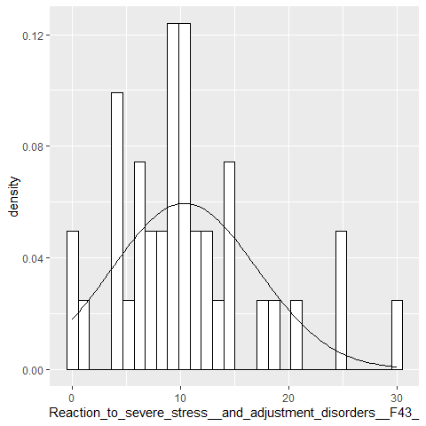

# Mental Health and Empathy Stats and Predictions

The data is avalible
<a href="https://www.rcpsych.ac.uk/docs/default-source/improving-care/ccqi/national-clinical-audits/ncaad-documents/spotlight-1/ncaad-spotlight-audit-trust-and-service-data-table.xls">here</a>
This is also shown below. Using the openxlsx library I will use that to
extract data from an Microsoft Excel spreadsheet which is the format the
data is in, and then I will story that data in a data.frame.

``` r
library(openxlsx)
data <- file.path("D:/Datasets/ncaad-spotlight-audit-trust-and-service-data-table.xlsx")
df1 <- openxlsx::read.xlsx(data)
```

## Research Questions

Some of the research questions that I will be posing is the following:
<ul>
<li>
Statistical Correlation Amoung Variables
</li>
<li>
Graphical Representations of the data
</li>
</ul>

To formulate it better I want to see if there is a correlation between
the groups, and different mental health variants, Male, Sex, Sexual
Orientation and so on have an impact in the empathy percentage. All the
data columns that are used from the original dataset are percentages,
which are then fed into a machine learning algorithm. My overall
contributions will be showing visulizations and the various tests I plan
to use to boost the statistical analysis, like the T-Test, and so on.

``` r
library(tidyverse)
```

# Variable Extraction

<p style="text-indent: 40 px">
Here I extracted a few columns that are important for the following
predictor variable. I have provided the full list of variables that are
in the data.frame
</p>

``` r
for (val in names(df1))
  cat(val, sep= "\n")
```

Here I begin to extract the columns from the data.frame that will be
used in each category such as age, gender, race, and mental illness.
From there I as well I pulled out the predictor variable.

``` r
age <- df1[c(9:14)]
gender <- df1[c(15:18)]
race <- df1[c(19:25)]
mental_illness <- df1[c(54:88)]
predictor <- df1[c(132)]
```

# Data Cleanup

There was a problem with data having both percentages, and part/whole so
the percentages were extracted from the data.frames that were extracted
from variable extraction.

``` r
transformation_1 <- function(y) {result <- as.data.frame(sapply(y, function(x) as.numeric(sub("%.*", "", x))))
return(result)}
```

``` r
age <- transformation_1(age)
head(age)
```

    ##   18-25 26-35 36-45 46-55 56-65 >65
    ## 1    11    18    18    14    14  25
    ## 2     9    20    28    15     8  20
    ## 3    40    23    17     7    13   0
    ## 4    41    26    19    15     0   0
    ## 5    19    30    12    14    14  12
    ## 6    17    23    22    23    13   1

``` r
names(age) <- c("EighteenthruTwentyFive","TwentySixThruThirty","ThirtySixThruFortyFive","FortySixThruFiftyFive","FiftySixThruSixtyFive","gtSixtyFive")
```

``` r
gender <- transformation_1(gender)
head(gender)
```

    ##   Male Female Nonbinary/other Unknown/not.documented
    ## 1   18     82               0                      0
    ## 2   34     66               0                      0
    ## 3   27     73               0                      0
    ## 4   15     85               0                      0
    ## 5   41     59               0                      0
    ## 6   30     68               1                      0

``` r
names(gender) <- c("Male","Female","Nonbinary.Other","Unknown.not.documented")
```

``` r
mental_illness <- transformation_1(mental_illness)
head(mental_illness,1)
```

    ##   Behavioural.and.emotional.disability
    ## 1                                   47
    ##   Progressive.conditions.and.physical.health
    ## 1                                         58
    ##   Mobility.and.gross.motor.disability
    ## 1                                   0
    ##   Memory,.ability.to.learn,.concentrate.or.understand
    ## 1                                                  32
    ##   Personal,.self-care.and.continence Hearing.disability Sight.disability
    ## 1                                  0                  0                0
    ##   Manual.dexterity Perception.of.physical.danger Speech.disability Other
    ## 1                0                             0                 0     5
    ##   Bipolar_problem BDD_problem Depression_problem Eating.disorder_problem GAD
    ## 1               4           0                 14                       0   0
    ##   Mixed.a&D_problem OCD_problem PanicDisorder_problem PD_problem PTSD_problem
    ## 1                18           4                     0          0           32
    ##   Specific.phobia_problem Socialphob_problem Other.Anx_problem
    ## 1                       0                  0                11
    ##   Otherdiag_problem Unknown_problem Depressive.episode.(F32)
    ## 1                18               0                       11
    ##   Recurrent.depressive.disorder.(F33);.persistent.mood.[affective].disorders.(F34);.other.mood.[affective].disorders.(F38,.F39)
    ## 1                                                                                                                            18
    ##   Phobic.anxiety.disorders.(F40);.other.anxiety.disorders.(F41);.obsessive-compulsive.disorder.(F42)
    ## 1                                                                                                 18
    ##   Reaction.to.severe.stress,.and.adjustment.disorders.(F43)
    ## 1                                                        25
    ##   Disorders.of.adult.personality.and behaviour.(F60-69)<U+200B>
    ## 1                                                             0
    ##   Behavioural.syndromes.associated.with.physiological.disturbances.and.physical.factors.(F50.-.F59) . <U+200B>
    ## 1                                                                                                            0
    ##   Mental.and.behavioural.disorders.due.to.psychoactive.substance.use.(F10-F19) . <U+200B>
    ## 1                                                                                       0
    ##   Bipolar.disorder<U+200B>.(F31) Other.diagnoses.not.listed.above   . <U+200B>
    ## 1                              4                                            25

``` r
names(mental_illness) <- c("Behaviouralandemotionaldisability","Progressiveconditionsandphysicalhealth","Mobilityandgrossmotordisability", "Memoryabilitytolearnconcentrateorunderstand","Personalselfcareandcontinence", "Hearingdisability","Sightdisability","Manualdexterity","Perceptionofphysicaldanger","Speechdisability","Other", "Bipolarproblem","BDDproblem", "Depressionproblem", "Eatingdisorderproblem","GAD","MixedaandDproblem","OCDproblem", "PanicDisorderproblem","PDproblem","PTSDproblem", "Specificphobiaproblem","Socialphobproblem", "OtherAnxproblem", "Otherdiagproblem","Unknownproblem", "DepressiveepisodeF32", "RecurrentdepressivedisorderF33persistentmoodaffectivedisordersF34othermoodaffectivedisordersF38F39","Phobic_anxiety_disorders__F40___other_anxiety_disorders__F41___obsessive_compulsive_disorder_F42_","Reaction_to_severe_stress__and_adjustment_disorders__F43_","Disorders_of_adult_personality_and_behaviour__F60_69_","Behavioural_syndromes_associated_with_physiological_disturbances_and_physical_factors__F50___F59__","Mental_and_behavioural_disorders_due_to_psychoactive_substance_use__F10_F19__","Bipolar_disorder__F31_","Other_diagnoses_not_listed_above_")
```

``` r
predictor <- transformation_1(predictor)
head(predictor)
```

    ##   Experience.empathy.Agree
    ## 1                      100
    ## 2                       73
    ## 3                       83
    ## 4                      100
    ## 5                       NA
    ## 6                       91

``` r
names(predictor) <- "Experience_empathy_Agree"
```

# After Data Clean Up

Merge data into one single data.frame to perform statistics, and
regression analysis.

``` r
Prediction.df <- drop_na(dplyr::bind_cols(age,gender,mental_illness,predictor))
head(Prediction.df, 1)
```

    ##   EighteenthruTwentyFive TwentySixThruThirty ThirtySixThruFortyFive
    ## 1                     11                  18                     18
    ##   FortySixThruFiftyFive FiftySixThruSixtyFive gtSixtyFive Male Female
    ## 1                    14                    14          25   18     82
    ##   Nonbinary.Other Unknown.not.documented Behaviouralandemotionaldisability
    ## 1               0                      0                                47
    ##   Progressiveconditionsandphysicalhealth Mobilityandgrossmotordisability
    ## 1                                     58                               0
    ##   Memoryabilitytolearnconcentrateorunderstand Personalselfcareandcontinence
    ## 1                                          32                             0
    ##   Hearingdisability Sightdisability Manualdexterity Perceptionofphysicaldanger
    ## 1                 0               0               0                          0
    ##   Speechdisability Other Bipolarproblem BDDproblem Depressionproblem
    ## 1                0     5              4          0                14
    ##   Eatingdisorderproblem GAD MixedaandDproblem OCDproblem PanicDisorderproblem
    ## 1                     0   0                18          4                    0
    ##   PDproblem PTSDproblem Specificphobiaproblem Socialphobproblem OtherAnxproblem
    ## 1         0          32                     0                 0              11
    ##   Otherdiagproblem Unknownproblem DepressiveepisodeF32
    ## 1               18              0                   11
    ##   RecurrentdepressivedisorderF33persistentmoodaffectivedisordersF34othermoodaffectivedisordersF38F39
    ## 1                                                                                                 18
    ##   Phobic_anxiety_disorders__F40___other_anxiety_disorders__F41___obsessive_compulsive_disorder_F42_
    ## 1                                                                                                18
    ##   Reaction_to_severe_stress__and_adjustment_disorders__F43_
    ## 1                                                        25
    ##   Disorders_of_adult_personality_and_behaviour__F60_69_
    ## 1                                                     0
    ##   Behavioural_syndromes_associated_with_physiological_disturbances_and_physical_factors__F50___F59__
    ## 1                                                                                                  0
    ##   Mental_and_behavioural_disorders_due_to_psychoactive_substance_use__F10_F19__
    ## 1                                                                             0
    ##   Bipolar_disorder__F31_ Other_diagnoses_not_listed_above_
    ## 1                      4                                25
    ##   Experience_empathy_Agree
    ## 1                      100

# Shapiro-Wilk Test of Normality

On each column the test was ran to gain an understanding of its
normality vs skewness.

``` r
blank=c()
ptest1 <- lapply(Prediction.df, stats::shapiro.test)
for (x in ptest1){
  blank <-c(blank,x$p.value)
}
for (i in 1:length(blank))
     print(paste(names(Prediction.df)[i],blank[i]))
```

    ## [1] "EighteenthruTwentyFive 0.000163285560599671"
    ## [1] "TwentySixThruThirty 0.61830021688381"
    ## [1] "ThirtySixThruFortyFive 0.0382559695055478"
    ## [1] "FortySixThruFiftyFive 0.219070166489885"
    ## [1] "FiftySixThruSixtyFive 0.0376777516744368"
    ## [1] "gtSixtyFive 0.0228730606145244"
    ## [1] "Male 0.0896688571899023"
    ## [1] "Female 0.0574611621189103"
    ## [1] "Nonbinary.Other 5.76386545464991e-11"
    ## [1] "Unknown.not.documented 5.11869078007987e-13"
    ## [1] "Behaviouralandemotionaldisability 0.0144073678028049"
    ## [1] "Progressiveconditionsandphysicalhealth 3.94936207749982e-05"
    ## [1] "Mobilityandgrossmotordisability 0.000299830689010403"
    ## [1] "Memoryabilitytolearnconcentrateorunderstand 4.84012826530475e-08"
    ## [1] "Personalselfcareandcontinence 9.98081376270843e-08"
    ## [1] "Hearingdisability 6.20283534338749e-09"
    ## [1] "Sightdisability 7.79271360563078e-09"
    ## [1] "Manualdexterity 8.30051727221444e-09"
    ## [1] "Perceptionofphysicaldanger 4.59684338753057e-12"
    ## [1] "Speechdisability 1.07820135002037e-11"
    ## [1] "Other 1.63117662302193e-09"
    ## [1] "Bipolarproblem 2.31632036259596e-07"
    ## [1] "BDDproblem 3.04258849849912e-12"
    ## [1] "Depressionproblem 0.69780129243565"
    ## [1] "Eatingdisorderproblem 2.32129812204403e-10"
    ## [1] "GAD 0.00182578783453079"
    ## [1] "MixedaandDproblem 0.0268092439439236"
    ## [1] "OCDproblem 8.41432738581713e-05"
    ## [1] "PanicDisorderproblem 3.07933151442977e-07"
    ## [1] "PDproblem 0.000896977443732828"
    ## [1] "PTSDproblem 0.000517588961786545"
    ## [1] "Specificphobiaproblem 3.64709123463295e-12"
    ## [1] "Socialphobproblem 5.38578718192108e-07"
    ## [1] "OtherAnxproblem 0.000739592860159148"
    ## [1] "Otherdiagproblem 0.00168289009082929"
    ## [1] "Unknownproblem 4.21456218245684e-09"
    ## [1] "DepressiveepisodeF32 0.0219891076906772"
    ## [1] "RecurrentdepressivedisorderF33persistentmoodaffectivedisordersF34othermoodaffectivedisordersF38F39 0.172101262159849"
    ## [1] "Phobic_anxiety_disorders__F40___other_anxiety_disorders__F41___obsessive_compulsive_disorder_F42_ 0.00104950905931045"
    ## [1] "Reaction_to_severe_stress__and_adjustment_disorders__F43_ 0.00640546699840654"
    ## [1] "Disorders_of_adult_personality_and_behaviour__F60_69_ 0.144612131739616"
    ## [1] "Behavioural_syndromes_associated_with_physiological_disturbances_and_physical_factors__F50___F59__ 9.60360771160671e-11"
    ## [1] "Mental_and_behavioural_disorders_due_to_psychoactive_substance_use__F10_F19__ 1.11161354076855e-09"
    ## [1] "Bipolar_disorder__F31_ 8.67459149976704e-06"
    ## [1] "Other_diagnoses_not_listed_above_ 2.74884837250993e-07"
    ## [1] "Experience_empathy_Agree 0.000174533413467428"

# Histogram With KDE Curve

In the following section I looped over my data set and produced
Histograms, with KDE Curves

``` r
library(ggplot2)
plotter <- function(s) ggplot(Prediction.df, aes_string(s)) +
        geom_histogram(aes(y = ..density..), colour = "black", fill = "white") +
        stat_function(fun = dnorm, args = list(mean = mean(Prediction.df[,s], na.rm = T), 
                                               sd = sd(Prediction.df[,s], na.rm = T))) +
        xlab(s)
lapply(X=names(Prediction.df),FUN=plotter)
```

    ## [[1]]


    ## 
    ## [[2]]


    ## 
    ## [[3]]


    ## 
    ## [[4]]


    ## 
    ## [[5]]


    ## 
    ## [[6]]


    ## 
    ## [[7]]


    ## 
    ## [[8]]


    ## 
    ## [[9]]


    ## 
    ## [[10]]


    ## 
    ## [[11]]


    ## 
    ## [[12]]


    ## 
    ## [[13]]


    ## 
    ## [[14]]


    ## 
    ## [[15]]


    ## 
    ## [[16]]


    ## 
    ## [[17]]


    ## 
    ## [[18]]


    ## 
    ## [[19]]


    ## 
    ## [[20]]


    ## 
    ## [[21]]


    ## 
    ## [[22]]


    ## 
    ## [[23]]


    ## 
    ## [[24]]


    ## 
    ## [[25]]


    ## 
    ## [[26]]


    ## 
    ## [[27]]


    ## 
    ## [[28]]


    ## 
    ## [[29]]


    ## 
    ## [[30]]


    ## 
    ## [[31]]


    ## 
    ## [[32]]


    ## 
    ## [[33]]


    ## 
    ## [[34]]


    ## 
    ## [[35]]


    ## 
    ## [[36]]


    ## 
    ## [[37]]


    ## 
    ## [[38]]


    ## 
    ## [[39]]


    ## 
    ## [[40]]



    ## 
    ## [[41]]


    ## 
    ## [[42]]


    ## 
    ## [[43]]


    ## 
    ## [[44]]


    ## 
    ## [[45]]


    ## 
    ## [[46]]


# Linear Regression

``` r
fit <- stats::lm(Experience_empathy_Agree~.,data = Prediction.df)
summary(fit)
```

    ## 
    ## Call:
    ## stats::lm(formula = Experience_empathy_Agree ~ ., data = Prediction.df)
    ## 
    ## Residuals:
    ## ALL 39 residuals are 0: no residual degrees of freedom!
    ## 
    ## Coefficients: (7 not defined because of singularities)
    ##                                                                                                     Estimate
    ## (Intercept)                                                                                        2171.7434
    ## EighteenthruTwentyFive                                                                              -58.4891
    ## TwentySixThruThirty                                                                                 -44.2832
    ## ThirtySixThruFortyFive                                                                              -53.6053
    ## FortySixThruFiftyFive                                                                               -56.5097
    ## FiftySixThruSixtyFive                                                                               -58.8645
    ## gtSixtyFive                                                                                         -57.5808
    ## Male                                                                                                 18.8324
    ## Female                                                                                               21.3778
    ## Nonbinary.Other                                                                                       4.3920
    ## Unknown.not.documented                                                                              272.1920
    ## Behaviouralandemotionaldisability                                                                     0.6506
    ## Progressiveconditionsandphysicalhealth                                                                3.0566
    ## Mobilityandgrossmotordisability                                                                      -1.7926
    ## Memoryabilitytolearnconcentrateorunderstand                                                          -4.4618
    ## Personalselfcareandcontinence                                                                       -12.4615
    ## Hearingdisability                                                                                    -7.7297
    ## Sightdisability                                                                                      10.2495
    ## Manualdexterity                                                                                      46.8272
    ## Perceptionofphysicaldanger                                                                           27.3151
    ## Speechdisability                                                                                   -119.3751
    ## Other                                                                                                -3.7700
    ## Bipolarproblem                                                                                       11.3525
    ## BDDproblem                                                                                          -45.9651
    ## Depressionproblem                                                                                    21.5208
    ## Eatingdisorderproblem                                                                                14.9756
    ## GAD                                                                                                   8.6122
    ## MixedaandDproblem                                                                                    14.6810
    ## OCDproblem                                                                                           21.3543
    ## PanicDisorderproblem                                                                                -10.3226
    ## PDproblem                                                                                             9.2031
    ## PTSDproblem                                                                                           5.6968
    ## Specificphobiaproblem                                                                                51.4723
    ## Socialphobproblem                                                                                     9.0740
    ## OtherAnxproblem                                                                                      14.0785
    ## Otherdiagproblem                                                                                     21.4950
    ## Unknownproblem                                                                                       10.3290
    ## DepressiveepisodeF32                                                                                 -6.0403
    ## RecurrentdepressivedisorderF33persistentmoodaffectivedisordersF34othermoodaffectivedisordersF38F39   -5.7672
    ## Phobic_anxiety_disorders__F40___other_anxiety_disorders__F41___obsessive_compulsive_disorder_F42_         NA
    ## Reaction_to_severe_stress__and_adjustment_disorders__F43_                                                 NA
    ## Disorders_of_adult_personality_and_behaviour__F60_69_                                                     NA
    ## Behavioural_syndromes_associated_with_physiological_disturbances_and_physical_factors__F50___F59__        NA
    ## Mental_and_behavioural_disorders_due_to_psychoactive_substance_use__F10_F19__                             NA
    ## Bipolar_disorder__F31_                                                                                    NA
    ## Other_diagnoses_not_listed_above_                                                                         NA
    ##                                                                                                    Std. Error
    ## (Intercept)                                                                                               NaN
    ## EighteenthruTwentyFive                                                                                    NaN
    ## TwentySixThruThirty                                                                                       NaN
    ## ThirtySixThruFortyFive                                                                                    NaN
    ## FortySixThruFiftyFive                                                                                     NaN
    ## FiftySixThruSixtyFive                                                                                     NaN
    ## gtSixtyFive                                                                                               NaN
    ## Male                                                                                                      NaN
    ## Female                                                                                                    NaN
    ## Nonbinary.Other                                                                                           NaN
    ## Unknown.not.documented                                                                                    NaN
    ## Behaviouralandemotionaldisability                                                                         NaN
    ## Progressiveconditionsandphysicalhealth                                                                    NaN
    ## Mobilityandgrossmotordisability                                                                           NaN
    ## Memoryabilitytolearnconcentrateorunderstand                                                               NaN
    ## Personalselfcareandcontinence                                                                             NaN
    ## Hearingdisability                                                                                         NaN
    ## Sightdisability                                                                                           NaN
    ## Manualdexterity                                                                                           NaN
    ## Perceptionofphysicaldanger                                                                                NaN
    ## Speechdisability                                                                                          NaN
    ## Other                                                                                                     NaN
    ## Bipolarproblem                                                                                            NaN
    ## BDDproblem                                                                                                NaN
    ## Depressionproblem                                                                                         NaN
    ## Eatingdisorderproblem                                                                                     NaN
    ## GAD                                                                                                       NaN
    ## MixedaandDproblem                                                                                         NaN
    ## OCDproblem                                                                                                NaN
    ## PanicDisorderproblem                                                                                      NaN
    ## PDproblem                                                                                                 NaN
    ## PTSDproblem                                                                                               NaN
    ## Specificphobiaproblem                                                                                     NaN
    ## Socialphobproblem                                                                                         NaN
    ## OtherAnxproblem                                                                                           NaN
    ## Otherdiagproblem                                                                                          NaN
    ## Unknownproblem                                                                                            NaN
    ## DepressiveepisodeF32                                                                                      NaN
    ## RecurrentdepressivedisorderF33persistentmoodaffectivedisordersF34othermoodaffectivedisordersF38F39        NaN
    ## Phobic_anxiety_disorders__F40___other_anxiety_disorders__F41___obsessive_compulsive_disorder_F42_          NA
    ## Reaction_to_severe_stress__and_adjustment_disorders__F43_                                                  NA
    ## Disorders_of_adult_personality_and_behaviour__F60_69_                                                      NA
    ## Behavioural_syndromes_associated_with_physiological_disturbances_and_physical_factors__F50___F59__         NA
    ## Mental_and_behavioural_disorders_due_to_psychoactive_substance_use__F10_F19__                              NA
    ## Bipolar_disorder__F31_                                                                                     NA
    ## Other_diagnoses_not_listed_above_                                                                          NA
    ##                                                                                                    t value
    ## (Intercept)                                                                                            NaN
    ## EighteenthruTwentyFive                                                                                 NaN
    ## TwentySixThruThirty                                                                                    NaN
    ## ThirtySixThruFortyFive                                                                                 NaN
    ## FortySixThruFiftyFive                                                                                  NaN
    ## FiftySixThruSixtyFive                                                                                  NaN
    ## gtSixtyFive                                                                                            NaN
    ## Male                                                                                                   NaN
    ## Female                                                                                                 NaN
    ## Nonbinary.Other                                                                                        NaN
    ## Unknown.not.documented                                                                                 NaN
    ## Behaviouralandemotionaldisability                                                                      NaN
    ## Progressiveconditionsandphysicalhealth                                                                 NaN
    ## Mobilityandgrossmotordisability                                                                        NaN
    ## Memoryabilitytolearnconcentrateorunderstand                                                            NaN
    ## Personalselfcareandcontinence                                                                          NaN
    ## Hearingdisability                                                                                      NaN
    ## Sightdisability                                                                                        NaN
    ## Manualdexterity                                                                                        NaN
    ## Perceptionofphysicaldanger                                                                             NaN
    ## Speechdisability                                                                                       NaN
    ## Other                                                                                                  NaN
    ## Bipolarproblem                                                                                         NaN
    ## BDDproblem                                                                                             NaN
    ## Depressionproblem                                                                                      NaN
    ## Eatingdisorderproblem                                                                                  NaN
    ## GAD                                                                                                    NaN
    ## MixedaandDproblem                                                                                      NaN
    ## OCDproblem                                                                                             NaN
    ## PanicDisorderproblem                                                                                   NaN
    ## PDproblem                                                                                              NaN
    ## PTSDproblem                                                                                            NaN
    ## Specificphobiaproblem                                                                                  NaN
    ## Socialphobproblem                                                                                      NaN
    ## OtherAnxproblem                                                                                        NaN
    ## Otherdiagproblem                                                                                       NaN
    ## Unknownproblem                                                                                         NaN
    ## DepressiveepisodeF32                                                                                   NaN
    ## RecurrentdepressivedisorderF33persistentmoodaffectivedisordersF34othermoodaffectivedisordersF38F39     NaN
    ## Phobic_anxiety_disorders__F40___other_anxiety_disorders__F41___obsessive_compulsive_disorder_F42_       NA
    ## Reaction_to_severe_stress__and_adjustment_disorders__F43_                                               NA
    ## Disorders_of_adult_personality_and_behaviour__F60_69_                                                   NA
    ## Behavioural_syndromes_associated_with_physiological_disturbances_and_physical_factors__F50___F59__      NA
    ## Mental_and_behavioural_disorders_due_to_psychoactive_substance_use__F10_F19__                           NA
    ## Bipolar_disorder__F31_                                                                                  NA
    ## Other_diagnoses_not_listed_above_                                                                       NA
    ##                                                                                                    Pr(>|t|)
    ## (Intercept)                                                                                             NaN
    ## EighteenthruTwentyFive                                                                                  NaN
    ## TwentySixThruThirty                                                                                     NaN
    ## ThirtySixThruFortyFive                                                                                  NaN
    ## FortySixThruFiftyFive                                                                                   NaN
    ## FiftySixThruSixtyFive                                                                                   NaN
    ## gtSixtyFive                                                                                             NaN
    ## Male                                                                                                    NaN
    ## Female                                                                                                  NaN
    ## Nonbinary.Other                                                                                         NaN
    ## Unknown.not.documented                                                                                  NaN
    ## Behaviouralandemotionaldisability                                                                       NaN
    ## Progressiveconditionsandphysicalhealth                                                                  NaN
    ## Mobilityandgrossmotordisability                                                                         NaN
    ## Memoryabilitytolearnconcentrateorunderstand                                                             NaN
    ## Personalselfcareandcontinence                                                                           NaN
    ## Hearingdisability                                                                                       NaN
    ## Sightdisability                                                                                         NaN
    ## Manualdexterity                                                                                         NaN
    ## Perceptionofphysicaldanger                                                                              NaN
    ## Speechdisability                                                                                        NaN
    ## Other                                                                                                   NaN
    ## Bipolarproblem                                                                                          NaN
    ## BDDproblem                                                                                              NaN
    ## Depressionproblem                                                                                       NaN
    ## Eatingdisorderproblem                                                                                   NaN
    ## GAD                                                                                                     NaN
    ## MixedaandDproblem                                                                                       NaN
    ## OCDproblem                                                                                              NaN
    ## PanicDisorderproblem                                                                                    NaN
    ## PDproblem                                                                                               NaN
    ## PTSDproblem                                                                                             NaN
    ## Specificphobiaproblem                                                                                   NaN
    ## Socialphobproblem                                                                                       NaN
    ## OtherAnxproblem                                                                                         NaN
    ## Otherdiagproblem                                                                                        NaN
    ## Unknownproblem                                                                                          NaN
    ## DepressiveepisodeF32                                                                                    NaN
    ## RecurrentdepressivedisorderF33persistentmoodaffectivedisordersF34othermoodaffectivedisordersF38F39      NaN
    ## Phobic_anxiety_disorders__F40___other_anxiety_disorders__F41___obsessive_compulsive_disorder_F42_        NA
    ## Reaction_to_severe_stress__and_adjustment_disorders__F43_                                                NA
    ## Disorders_of_adult_personality_and_behaviour__F60_69_                                                    NA
    ## Behavioural_syndromes_associated_with_physiological_disturbances_and_physical_factors__F50___F59__       NA
    ## Mental_and_behavioural_disorders_due_to_psychoactive_substance_use__F10_F19__                            NA
    ## Bipolar_disorder__F31_                                                                                   NA
    ## Other_diagnoses_not_listed_above_                                                                        NA
    ## 
    ## Residual standard error: NaN on 0 degrees of freedom
    ## Multiple R-squared:      1,  Adjusted R-squared:    NaN 
    ## F-statistic:   NaN on 38 and 0 DF,  p-value: NA
